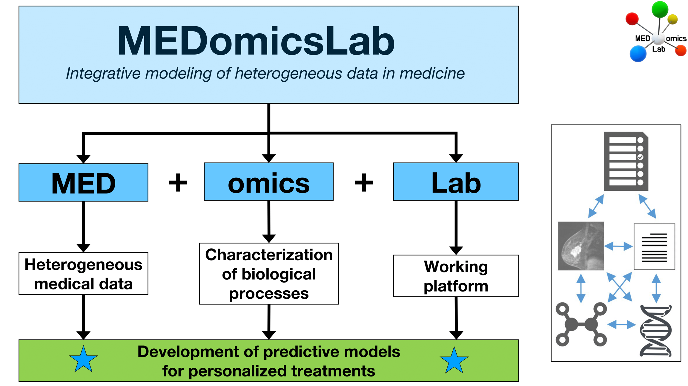
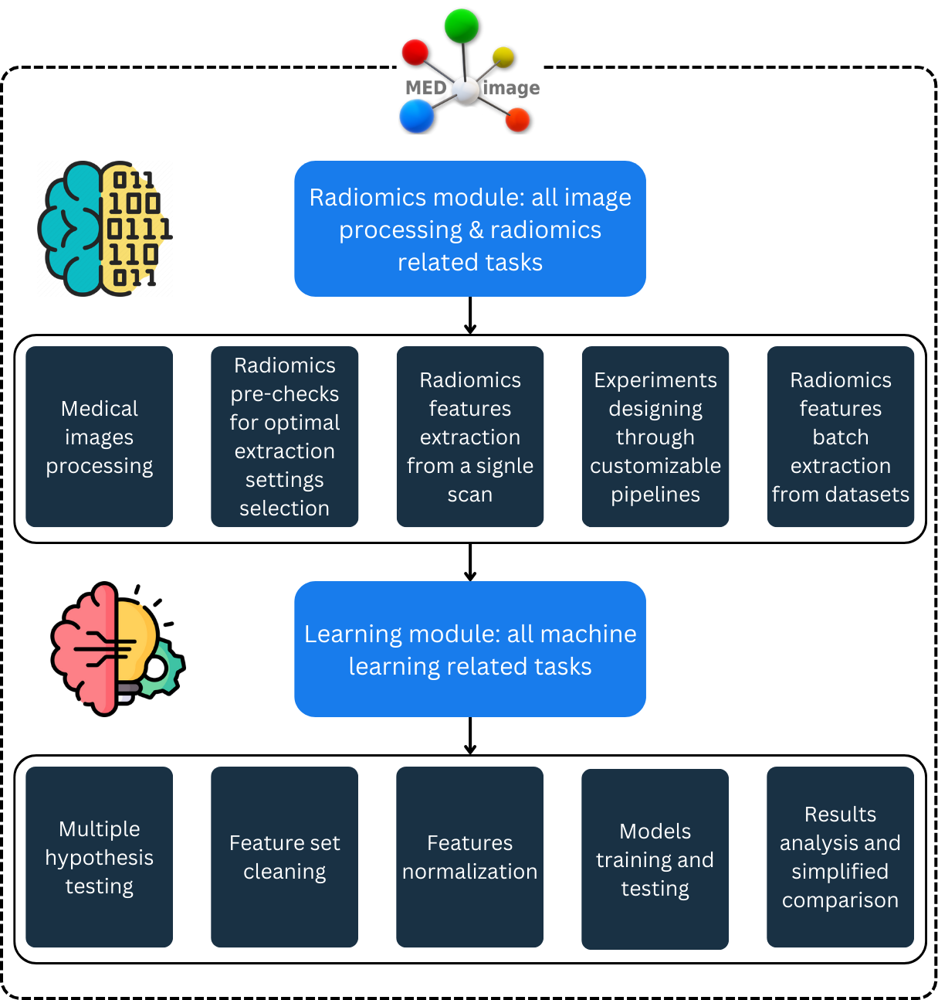

# 👋 Welcome!


This application represents the latest version of the radiomics module used in MEDomicsLab platform. We strive to keep both synchronized.


Welcome to the MEDimage-app documentation, where you will find all the resources you need to download, install and use the application.

### MEDomicsLab

This application is part of the [MEDomicsLab ](https://medomics-udes.gitbook.io/medomicslab-docs)project. It provides a graphical user interface to interact with the [MEDimage package](https://github.com/MEDomics-UdeS/MEDimage), enabling users to extract radiomics features from medical images and analyze the data using machine learning models.

<figure><figcaption>
<em>MEDomicsLab</em> overview
</figcaption></figure>

### The MEDimage application

The MEDimage-app is a graphical implementation of the MEDimage Python package. It enables the use of all MEDimage functionalities through an interactive interface. These functionalities include image processing, radiomics feature extraction, and machine learning tools.

### Our goal

The goal of the MEDimage app is to facilitate radiomics analyses for researchers from various disciplines and push for greater synergy among multidisciplinary teams. To achieve this, the application allows users to design their own experiments by customizing pipelines and defining specific settings. The back-end code is implemented in a modular way, ensuring easy adaptation and modification to meet diverse research needs. Additionally, users can generate Python code for their designed experiments, enabling reproducibility and further customization. With its intuitive interface and robust capabilities, the MEDimage app is designed to enhance research efficiency and collaboration. The following figure depicts the different parts of the app:

<figure><figcaption>
MEDimage-app modules overview
</figcaption></figure>

Before diving in, we recommend familiarizing yourself with the concepts of radiomics. You can read more about radiomics [here](radiomics/).

### Quick documentation guide

* To download and install the application, go to the [next page](quick-start.md).
* For tutorials, refer to the [radiomics page](radiomics/).
* Use [_Forms_ ](broken-reference)section to contact us or to report an issue.
* The [_Media_ ](broken-reference)section contains all our communication and interaction websites.
* If you are ready to add your touch to our application, refer to the [contribution page](contributing.md).
