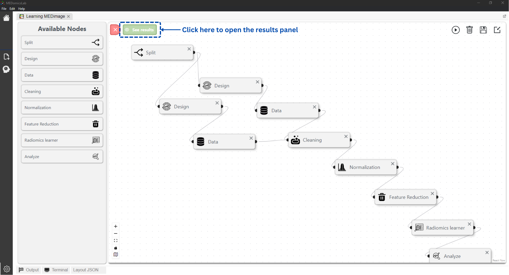
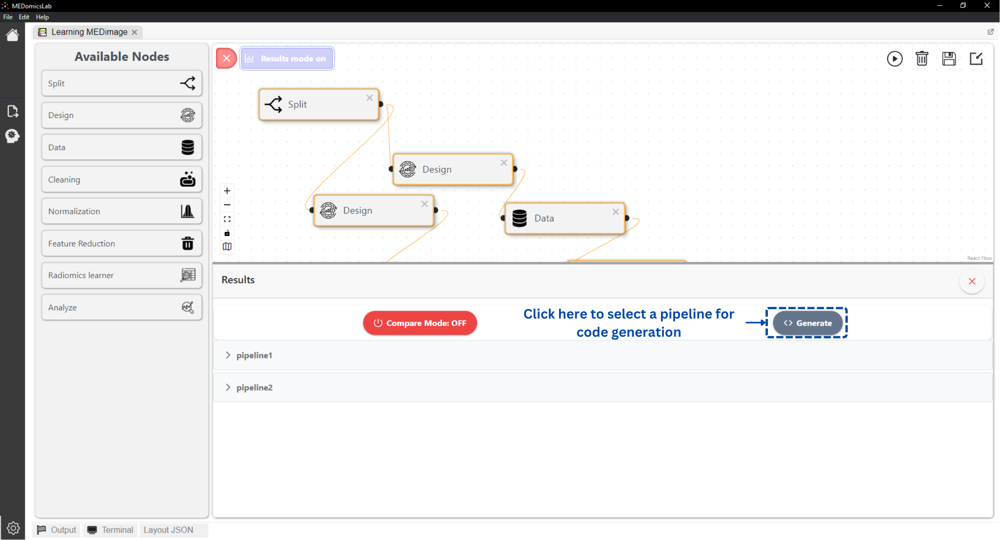
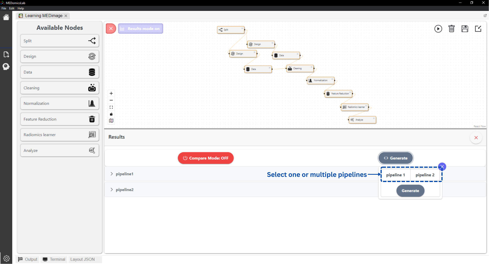
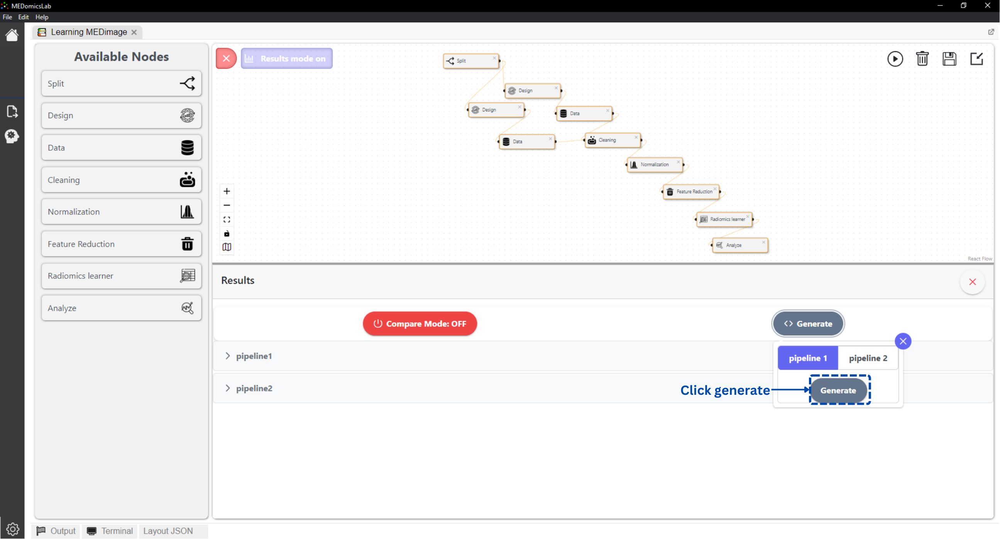
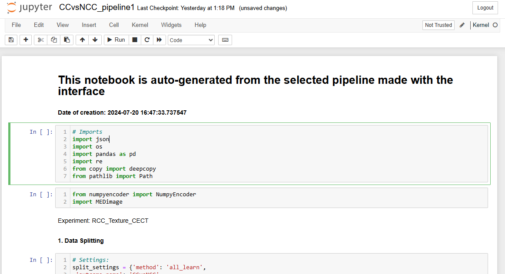
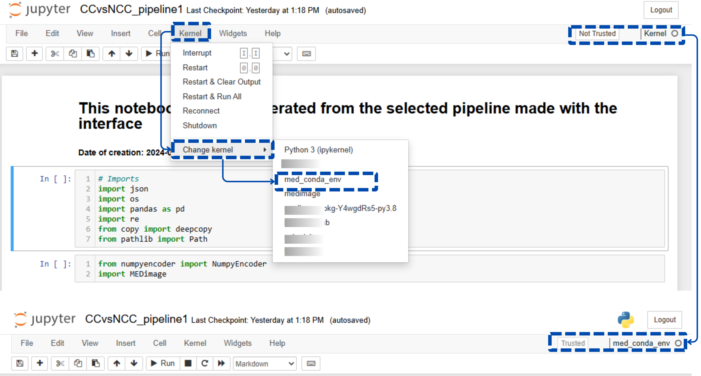

# ♻️ Code generation

The code generation feature in the learning module allows users to generate Python code for their experiments with a simple click. This feature enables users to make in-depth changes to the experiment code, share it with other computer scientists, and navigate seamlessly between the user interface and the code base.&#x20;

After running one or multiple experiment pipelines, follow the instructions below to generate the code for a given pipeline.

* Open the results panel:

<figure><figcaption></figcaption></figure>

* Click the _Generate_ button to select your pipelines for code generation:

<figure><figcaption></figcaption></figure>

* Select the pipelines

<figure><figcaption></figcaption></figure>

* Click generation:

<figure><figcaption></figcaption></figure>

Consequently, a[ _juypter notebook_](https://jupyter.org/) will automatically open with the generated code:

<figure><figcaption></figcaption></figure>



In most cases, you need to select the appropriate kernel before running the Jupyter notebook. Follow the instructions below to do so.


### Selecting the kernel for your generated code

* Click kernel
* Change kernel
* Select: _med\_conda\_env_
* The selected kernel's name must appear on the top right

<figure><figcaption></figcaption></figure>


If _med\_conda\_env_ kernel is missing from your kernel's list.  Follow the instructions below to add it.


Add your _med\_conda\_env_ to your kernel's list by running the following two commands:

```
conda activate med_conda_env
python -m ipykernel install --user --name=med_conda_env
```

Please feel free to [contact us](forms/contact-us.md) if you need any further assistance :innocent:.
