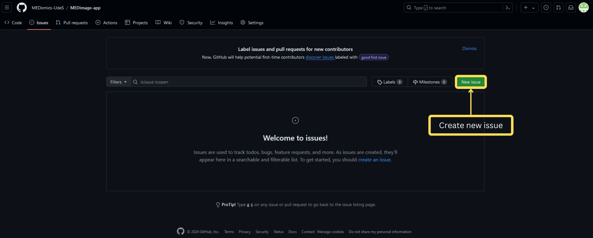
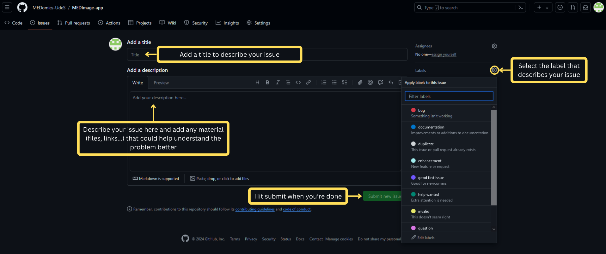

# ⚠️ Report an issue


Below, a brief guide on how to submit a new issue.


Use our GitHub page to open and report an issue: [https://github.com/MEDomics-UdeS/MEDimage-app/issues](https://github.com/MEDomics-UdeS/MEDimage-app/issues)

First, hit new issue to create a new one

<figure><figcaption></figcaption></figure>

Now follow the steps described below to fill the information about your issue and submit it

<figure><figcaption></figcaption></figure>

If you have any questions or need further assistance, please do not hesitate to [contact us.](contact-us.md)
