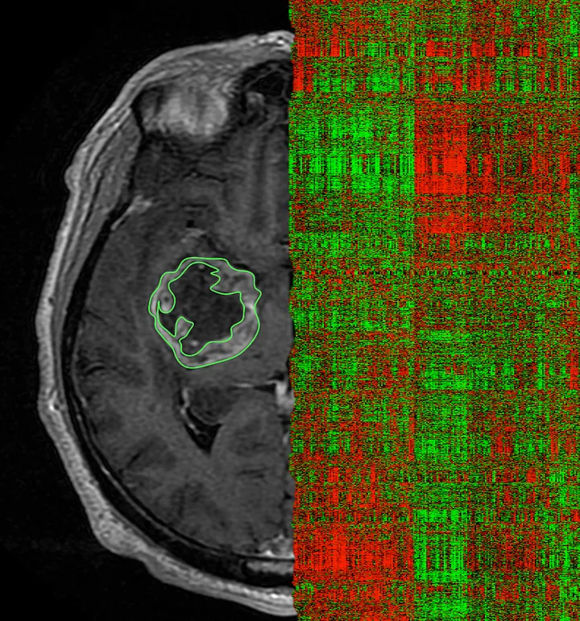
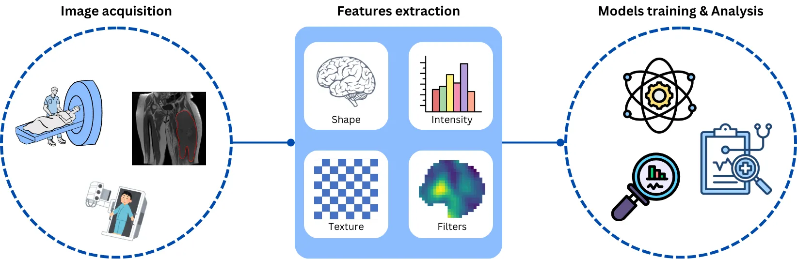
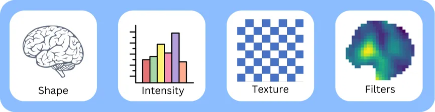

# 🧠 Radiomics

### What is radiomics?

Radiomics refers to the high-throughput quantitative image analysis which aims at extracting a large number of features characterizing a region of interest in the medical image. Radiomics analysis can be performed on medical images from different modalities, e.g., from from magnetic resonance imaging (MRI), computed tomography (CT), and positron-emission-tomography (PET). This approach enhances the existing data available to clinicians by quantifying the spatial distribution of signal intensities, voxels interrelationships and textural information.

<figure><figcaption>
Image credit: <a href="https://med.stanford.edu/gevaertlab/ReviewRadiomicsBrain.html">Review on Radiomics for Brain Tumors</a>.
</figcaption></figure>

### Radiomics typical workflow

The figure below demonstrates the necessary stages in a typical radiomics pipeline, emphasizing the crucial aspects of the radiomics analysis procedure.

<figure><figcaption>
Radiomics analysis typical workflow
</figcaption></figure>

### Radiomics features

Feature extraction is the final processing step where feature descriptors are utilized to quantify characteristics of the grey levels within the ROI. The set of features can be classified into various families, including intensity-based statistical features, intensity histogram-based features, intensity-volume histogram-based features, morphological features, local intensity features, and texture matrix-based features. Each family has the potential to reveal tumoral patterns, size, shape, and textural characteristics that may not be discernible to the naked eye. Additionally, features can be computed on the base image, as well as from filtered images.

<figure><figcaption>
Feature categories
</figcaption></figure>

Many different ways and formulas exist to calculate these features, therefore, adherence to the [Image Biomarker Standardization Initiative (IBSI)](https://theibsi.github.io/) guidelines is recommended. These guidelines offer a consensus for standardized feature calculations from all radiomic features.

**Craving more details? Keep reading** [**here**](https://medium.com/@mahdiall99/radiomics-in-medical-imaging-a-brief-introduction-3208863aae87)**.**
